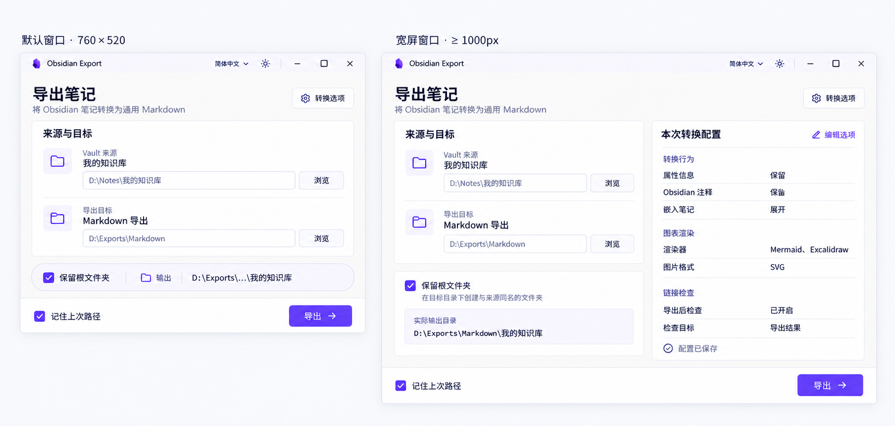

# 桌面 GUI 美化与响应式布局规格

| 项目 | 内容 |
| --- | --- |
| 状态 | ready-for-agent；视觉方向已获用户确认，等待另一个 Agent 实现 |
| 日期 | 2026-09-09 |
| 阅读基线 | `desktop`，`f447ccacdaf0dc1e9b35c0635c9ed9328f98d72d` |
| 关联 Issue / PR | [总规格 #37](https://github.com/ONEGAYI/obsidian-export-desktop/issues/37)；#38 → #39 → #40；未创建 PR |
| 范围 | 桌面端视觉与布局、可靠的输出路径预览；不实现转换逻辑 |
| 参考图 | [reference.png](reference.png)，以最终胶囊版本为准 |
| 接手入口 | [handoff.md](handoff.md) |

**GitHub 总规格 Issue 为规格单一事实源**；本文件是首次发布快照，后续决策先更新 Issue。本地保留参考图和交接材料，不独立维护第二套规格。

## 1. 问题与方案

当前主界面使用居中的窄卡片，主区域限制为 `max-w-xl`，设置视图限制为 `max-w-2xl`；大窗口的可用空间未充分利用。用户希望采用纸白淡紫风格，并使布局同时适应默认窗口和最大化窗口。

**方案是按宽、高两个独立条件布局**：宽度决定是否显示右侧配置详情，高度决定根文件夹选项与输出路径是单行胶囊还是展开区。底部操作栏保留稳定位置，中央内容随可用空间伸展。



参考图只用于颜色、分组和层次。图中文字中的路径与选项是示例，尺寸标签也不是像素级实现证据。文字契约优先于图像误差；实现必须在真实窗口下验证。

## 2. 已确认决定与工程取值

### 用户已确认

- 采用纸白淡紫方案；主操作区呈现“来源与目标”。
- 移除参考图中的“导出流程”介绍，不增加步骤条或流程卡片。
- 将“保留根文件夹”和“实际输出目录”放在路径选择区下方，独立于路径卡片。
- 默认宽度隐藏配置详情；超过宽度阈值才显示右侧详情。
- 默认高度下，根文件夹选项与实际输出路径压成**一行胶囊**。
- 高度充足时保留展开形态；全屏空间用于现有功能内容。
- 本轮仅完成规格和交接，implement 由用户安排的另一个 Agent 执行。

### 本规格采用的工程取值

下列取值使方案可执行，并非用户逐像素指定：

| 条件 | 规则 |
| --- | --- |
| `W < 1000` | 配置详情完全隐藏，不搬到下方，也不替换成折叠摘要 |
| `W >= 1000` | 配置详情显示于右侧 |
| `H < 640` | 根文件夹与输出路径使用单行胶囊 |
| `H >= 640` | 使用展开区，含解释文字和完整输出路径 |

`W`、`H` 是 WebView 的 CSS 视口宽高，不是截图物理像素、显示器分辨率或外框尺寸。显示缩放引起的有效视口变化按相同规则处理。

默认窗口继续为 760×520，最小窗口继续为 560×480；不通过调大默认或最小尺寸掩盖布局问题。高度阈值 640 是为实施确定的初值；如实际中英文字体证据要求调整，记录原因并同步规格和边界验收，不能改成按宽度判断胶囊。

## 3. 用户故事

1. 作为导出用户，我希望在默认窗口一次看到来源、目标和导出按钮，以便快速开始任务。
2. 作为导出用户，我希望继续浏览目录或手动编辑来源与目标路径，以便使用中文、空格、相对路径及单篇笔记路径。
3. 作为导出用户，我希望调整保留根文件夹后看到相应输出目录，以便避免把文件导出到意外位置。
4. 作为使用矮窗口的用户，我希望上述选项和路径收成一行，以便节约垂直空间。
5. 作为使用高窗口的用户，我希望看到展开的路径和说明，以便核对落点。
6. 作为使用宽窗口的用户，我希望并排查看真实配置详情，以便导出前核对转换行为。
7. 作为使用窄窗口的用户，我希望通过转换选项入口完成设置，而不用处理额外摘要面板。
8. 作为键盘用户，我希望能操作复选框、查看完整路径和返回原控件，以便完成同样的导出流程。
9. 作为中英文或深浅主题用户，我希望切换后内容仍完整可读，且偏好被保留。
10. 作为需要确认的用户，我希望点击导出后仍能核对路径和选项，以便开始前发现错误。
11. 作为运行中的用户，我希望调整窗口后仍看到进度、日志和取消入口，且不会重复或丢失进度事件。
12. 作为查看结果的用户，我希望能查看成功、跳过、失败及链接检查结果，并返回配置页继续使用。
13. 作为遇到错误的用户，我希望空输入、无效路径、预览失败、边车不可用和取消操作都有可辨认的状态。
14. 作为使用设置页的用户，我希望六类设置和关于与更新功能保持可用，且改变的配置及时反映在首页。

## 4. 视图与布局契约

### 4.1 应用外壳

- 保留现有自定义 Windows 标题栏、拖动区域、语言菜单、三态主题切换和窗口控制。
- 主内容使用可伸展容器；取消使整个工作区恒为窄卡片的宽度限制。默认左、右内边距约 20–24px，宽屏约 32–40px，间距约 16–24px。
- 首页按“页标题与转换选项入口 → 路径卡片 → 根文件夹/输出区 → 底部操作栏”排序。
- 默认和宽屏均保留“转换选项”入口。宽屏详情的“编辑选项”进入同一个设置视图。
- 底部操作栏不被正文挤出视口。优先使用布局中的固定高度行与可滚动中间区域，而不是覆盖正文的绝对定位。
- 最小窗、放大字体和错误长文可触发正文滚动；不得遮住输入、焦点和底部按钮。正常 760×520 首页应完整容纳，不依赖正文滚动。
- 页面无整体横向滚动条。表单、长路径、日志和详情容器允许收缩，不能由内容撑宽网格。

### 4.2 路径卡片

仅包含“来源与目标”标题、来源选择行和目标选择行。每行具有小图标、字段标签、已选名称、可编辑完整路径和浏览按钮。

- 名称从当前输入派生，不使用图片中的示例名称；空输入呈现占位文案，不显示虚构的知识库。
- 输入保持原有可编辑、可粘贴能力。现有浏览按钮为 `directory: true`，此次保留；单文件通过手动路径输入继续支持，不新增文件/目录选择器模式。
- 路径末尾分隔符不能导致名称空白；盘符根和无法提取名称时显示合理的路径回退。不得全局修改日志用 `baseName` 的语义来强行适配首页。
- `PathPicker` 同时被设置页复用。首页展示可以增加可选变体，不能让工具路径或设置路径无故套上“来源与目标”的布局。

### 4.3 单行胶囊与展开区

**胶囊**：建议高 36–40px，淡紫底、细边框、圆角；“复选框 + 保留根文件夹”是不可压缩的操作组，后接分隔线、输出标识和可压缩路径。隐藏解释段落和两层套框。

- 胶囊始终一行，不因中英文或长路径变两行。
- 路径采用中间或尾部省略，优先保留最后的目录名；显示省略不能改变提交值。
- 悬停和键盘聚焦均可查看完整路径，且完整文本可选择、复制。只给鼠标 `title`、键盘拿不到文本，不算完成。
- 560px 窗口的英文标签可以使用准确的短文案；优先收缩路径，不缩小到不可读字体或遮盖复选框。
- 宽而矮的窗口也必须使用胶囊，不能让配置侧栏的出现强制展开输出区。

**展开区**：显示同一个根文件夹选项、简短说明，以及另起一行的实际输出路径。长路径允许换行。两种外观使用同一份状态，切换尺寸不重置用户选择。

### 4.4 配置详情

右侧为只读配置，建议占可用内容宽度的 35%–40%，剩余由路径区使用。详情过长时可以滚动；不能因为右侧内容过高，把首页主要操作挤出。

固定展示以下分组，文字从现有双语字典及当前 `ExportOptions` 派生：

| 分组 | 字段与显示要求 |
| --- | --- |
| 转换行为 | `frontmatter` 三态、`comments` 三态、递归嵌入是否开启 |
| 图表渲染 | 已启用渲染器名称；为空显示“未启用”；启用时展示所选输出格式 |
| 链接检查 | `linkCheckEnabled`；关闭时检查目标显示“不适用”，开启时显示实际 `linkCheckTarget` |
| 其他非默认选项 | 有内容时展示已有过滤、文件/过程、缺失章节策略等摘要，以及启用渲染时的工具路径覆盖数量 |

`frontmatter=auto` 必须显示“自动”，不能将三种策略统一写成“保留”。`noRecursiveEmbeds=true` 表示**不展开嵌入中的嵌套嵌入**，并非完全不展开任何嵌入。

当前真实默认值：图表渲染器为空、链接检查关闭、检查目标为来源、修改时间不保留。参考图中的 Mermaid/Excalidraw、已开启检查等仅是示例，不修改默认配置来匹配图片。

“配置已保存”只指选项已按现有机制保存；不意味着来源、依赖工具或输出目录已校验成功。不要重复列出同一配置两遍；不引入预设、历史或安装状态探测。

### 4.5 确认、设置、运行和结果

- 点击“导出”仍先打开 `ExportDialog`，确认后才启动边车。
- 根文件夹选项的主要编辑入口移到首页；确认框改为显示同一状态的只读摘要，避免两个独立选择。关闭确认框或编辑选项后返回，保持输入和偏好。
- 设置页保留现有六页及 ARIA tabs 键盘行为；使用可伸展页壳和合理字段阅读宽度，不把表单控件横拉至整个显示器。此次不改成工作台式常驻左侧总导航。
- 运行页统一主题，进度与取消操作保持可见；日志区域使用剩余高度，宽屏可将进度摘要与日志并排。布局改变不修改事件折叠、计数口径和自动滚动业务。
- 结果页在宽屏且链接检查实际可见时，将导出结果与检查结果并排；未启用检查时不留空列。窄屏按原逻辑堆叠，失败详情与检查错误不能因布局被隐藏。
- 关于与更新只做同主题和容器适配，保留代理、检查、下载、取消和安装确认交互。

## 5. 输出路径预览的准确性

### 已核查的现状

`ExportDialog.tsx` 当前根据 `keepRootFolder` 直接拼接字符串；桌面 Rust 后端 `spawn_export_sidecar` 则先将输入相对 GUI 工作目录转为绝对路径，再调用 `resolve_destination`。

后端只对**有末级名称的目录来源**追加根文件夹名。单文件来源和没有末级名称的盘符根不追加。新首页不能复制旧确认框的拼接近似值并称其为实际落点。

### 选定的实现方案

新增桌面端内部只读命令 `preview_export_destination`，输入 `source`、`destination`、`keepRootFolder`，返回解析后的绝对目标路径和来源类型（目录、文件或其他），或可展示的错误。TS 封装放在现有边车调用层；首页和确认框共用一份预览状态。

- 复用 `resolve_destination` 及与启动一致的绝对路径解析规则。必要时将两处共同的只读路径解析提取为内部辅助函数，不能复制两套规则。
- 可查询单个来源路径的元数据。不得启动边车、创建目录、扫描 vault、占用导出/检查/更新的进程槽，也不得改 CLI 转换逻辑。
- 空输入不请求；输入变化后短暂合并请求，建议约 150ms。修改来源、目标、根文件夹状态时失效旧结果。
- 异步结果只接受与最新输入相符的一次；较慢的旧结果不能覆盖新选择。尺寸与语言切换不触发额外文件系统查询。
- 未完成、无效或无法访问时显示“等待选择 / 正在解析 / 无法预览”等对应状态，不能保留旧路径冒充当前结果；技术细节可展开查看。
- 无效来源不能被误报为有效单文件；预览成功只证明能够解析，不证明目标可写或导出必然成功。
- 对有效输入，确认框复用最新预览；预览不可用时明确显示输入与未能预览状态，保留现有由后端报告启动失败的处理路径，不另造一套导出校验规则。
- 真正执行后仍以 `start_export` 返回值定位导出产物和自动链接检查。预览与启动之间文件系统可能变化，启动结果是最终依据。
- 单文件来源仍保留用户的根文件夹偏好，但展示其对本次单文件无效；不能追加笔记文件名为目录。

这项变更属于桌面端路径展示与编排，不违反“桌面端不承担 Markdown 转换”的边界。不需要新增文件系统插件、扩展任意 shell 权限或修改 JSON Lines 事件协议。

## 6. 视觉、交互与状态

- 浅色以暖白页面、近白面板、淡紫辅助底和紫色主按钮为主。建议起点：页面 `#F5F4F1`、面板 `#FEFEFC`、文字 `#28262F`、强调 `#7656CE`；最终以可读性和主题一致性为准。
- 深色复用现有石墨灰与柔紫方向，用同一套语义变量映射。保持 light/dark/system 偏好及 zh/en/system 语言偏好。
- 主要修改 `index.css` 的语义颜色与间距、圆角层次；图标沿用现有 Lucide。无需新图标包、远端字体或额外装饰图。
- 正文约 14px，路径 12–13px，标题约 22–24px；不靠巨型字号填充宽屏，不照抄图像里过大的留白。
- 焦点可见、标签可访问、Tab 顺序合理；隐藏的详情不能留下可聚焦的不可见按钮，恢复窗口时不能重置输入。
- localStorage 键名、加载和保存语义、默认选项全部保持；无 schema 迁移、无新数据库。
- 首屏文案讲用户任务，不暴露“CLI 非默认参数”“边车传参”等实现细节；错误详情仍可保留必要技术信息。

## 7. 修改边界与代码入口

| 入口 | 本次职责 |
| --- | --- |
| `desktop/src/App.tsx` | 可伸展外壳、共用输入/预览状态、各阶段布局；保留事件订阅生命周期 |
| `desktop/src/index.css` | 深浅主题、响应式布局与胶囊样式 |
| `desktop/src/components/PathPicker.tsx` | 首页路径展示变体；保持其他调用处可用 |
| `desktop/src/components/ExportDialog.tsx` | 使用可靠预览与只读根文件夹摘要 |
| `desktop/src/lib/options.ts` | 按需要复用/扩展只读摘要，不修改选项默认值 |
| `desktop/src/i18n/zh.ts`、`en.ts` | 成对文案、准确的状态和配置名称 |
| `OptionsView`、`ExportRunView`、`ExportResultView`、`LinkCheckPanel`、`UpdatePanel` | 同主题与容器适配，保持功能和状态机 |
| `desktop/src/lib/sidecar.ts` | 新增只读预览命令的类型化封装 |
| `desktop/src-tauri/src/sidecar.rs`、`lib.rs` | 共用路径解析、只读命令、注册与契约测试 |

可按职责抽出首页、配置摘要和输出区组件；避免继续把所有 JSX 堆进 `App.tsx`。新增文件通过 file-tree 登记，无需为一次布局改造建设新的通用框架。

### 明确不做

- 不实现新转换、云服务、历史任务、预设、Markdown 实时预览、虚构统计或图表依赖探测。
- 不改 CLI 参数、JSON Lines 协议、进程槽互斥、取消/更新业务和现有转换语义。
- 不新增工作台总导航或“导出流程”步骤条。
- 不发布版本、不修改版本号、不把布局变更扩展成全仓重构。
- 本规划 Agent 仅创建规格、tickets 和交接材料，不写实现代码、不代替后续 Agent 运行实现验收、不创建 PR。

## 8. 实现顺序与测试决定

### 三个 tickets、一个 PR

1. 先锁定路径预览与现有后端解析一致的行为测试，再接入只读命令及预览状态。
2. 实现首页、独立宽高规则、胶囊和真实配置详情；接入已有主题、字典与确认框。
3. 适配设置、运行、结果视图，验证状态不会随布局切换重置。
4. 完成自动化验证、真实窗口验收和 code-review，交由用户验收后按既有规则提交/推送。

按用户后续决定使用 GitHub Issues 管理规格与 tickets：任务一打通路径预览与确认；任务二完成响应式首页与配置详情，依赖任务一；任务三适配其余页面并完成全流程回归，依赖任务二。三个任务可由同一个实现 Agent 依次完成，最终汇总一个 PR；不需要并行 Agent 或额外 worktree 编排。若接手时基线已变化，先检查当前 diff，保护其他人的工作。

### 有意义的测试

- **Rust 路径契约**：目录开/关根文件夹、单文件、盘符根、中文空格、相对路径、尾部分隔符、无效来源；预览与启动的公共解析结果一致，预览不会创建目录。使用真实临时目录；跨平台用平台有效的路径，不新增只在 Windows 成立的通用断言。
- **前端用户行为**：修改根文件夹后路径及确认摘要一致；预览请求乱序只接受最新结果；空值与失败清掉过期路径；修改配置后详情更新；改变视口不重置输入、不重订阅事件；长路径可通过键盘获取完整文本。
- **既有契约**：运行 Vitest 全套，包括事件折叠、链接检查、设置页签、更新状态及双语字典占位符一致性。
- **布局测试**：CSS 断点不能靠测一个返回布尔值的复制函数证明。使用真实浏览器/WebView 的视口、元素可见性、边界和截图；不以快照锁住每个 className。

当前 Vitest 主要测试纯函数，尚无已配置的 DOM 组件或浏览器布局测试入口。优先利用真实浏览器测试用户行为，模拟只限 Tauri 命令/事件边界；如需引入最小测试依赖，由实现 Agent 随测试提交并记录用途。禁止把测试假状态注入生产页面。

### 必跑命令

在仓库根目录执行；依赖不存在时先按 `docs/BUILD.md` 安装：

```powershell
pnpm -C desktop test
pnpm -C desktop build
just desktop-sync-sidecar
just desktop-test
python .agents/skills/file-tree/scripts/tree_tool.py check --strict
git diff --check
```

`desktop-sync-sidecar` 必须在桌面 Rust 检查前完成；它解决编译期 externalBin 依赖，不表示本次修改了 CLI。涉及 Rust 文件时遵守仓库固定 nightly 的格式化要求，避免无关重排。真实桌面启动使用 `just desktop-dev`。

### 视口与主题验收矩阵

| CSS 视口 | 首页详情 | 根文件夹/输出区 | 核查重点 |
| --- | --- | --- | --- |
| 560×480 | 隐藏 | 胶囊 | 最小窗口，中英文控件可达且无横向溢出 |
| 760×520 | 隐藏 | 胶囊 | 默认窗口主要内容一屏可见 |
| 999×800 | 隐藏 | 展开 | 高度充足也不能显示详情 |
| 1000×520 | 显示 | 胶囊 | 宽而矮，两个条件独立 |
| 1000×639 / 1000×640 | 显示 | 胶囊 / 展开 | 高度临界点 |
| 1440×900 | 显示 | 展开 | 双栏比例、完整路径与详情 |
| 1920×1080 | 显示 | 展开 | 主区域随窗口使用宽度，日志利用高度 |

760×520 和 1440×900 至少覆盖中文/英文 × 浅色/深色四种组合；另测 system 模式跟随切换。其余尺寸重点检查最长标签、长路径与溢出，并在 Windows 125%/150% 缩放下至少各做一次真实窗口烟测，记录实际 CSS 视口。

对来源/目标为空、300 字符长路径、单篇笔记、目录根、预览乱序与错误、边车不可用、导出运行/取消/失败、链接检查运行/完成/失败，以及设置页更新面板进行可操作性验收。长路径仅用于布局压力，不承诺底层文件系统支持任意长度。

## 9. 完成标准与交接

- 上述行为测试与构建通过；真实窗口证据能证明宽高独立响应，未实现的项目必须标明。
- 默认窗口无参考图“流程卡片”，胶囊只占一行；宽屏详情数据来自真实配置。
- 首页、确认框、启动返回的输出路径按同一后端规则解释。
- 既有导出/检查/取消/更新、语言和主题流程无回归；新增文案成对维护。
- file-tree 与文档入口同步；审查按仓库规范与本规格两方面进行。
- 提供截图、验证命令结果、已知限制供用户验收；本规格的 `ready-for-agent` 不是验收通过。

后续 Agent 从 [handoff.md](handoff.md) 接手；新 Agent 应先读取当前工作区状态，再按本规格进入 implement。

## 10. 远端任务入口

- [#38 统一输出路径预览与导出确认](https://github.com/ONEGAYI/obsidian-export-desktop/issues/38)：无阻塞，先接手。
- [#39 纸白淡紫响应式首页与输出胶囊](https://github.com/ONEGAYI/obsidian-export-desktop/issues/39)：依赖 #38。
- [#40 设置与导出各阶段适配及回归](https://github.com/ONEGAYI/obsidian-export-desktop/issues/40)：依赖 #39。

父子关系与阻塞关系已写入 GitHub 原生结构。后续任务状态和规格变更以远端为准。
