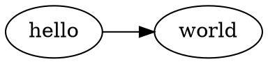

# Diagram sampler


```dot
digraph { rankdir=LR; hello -> world }
```


```mermaid
graph TD; A-->B
```

```wavedrom
{ signal: [{ name: "clk", wave: "p..." }] }
```

```tikz
\draw (0,0) -- (1,1);
```

A plain fenced block that is not a diagram:

```rust
fn main() {}
```
